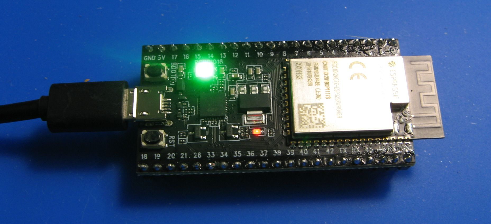
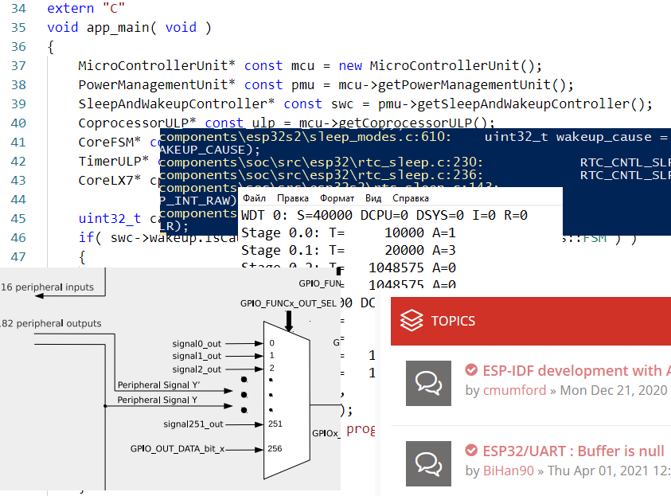

The [ESP32-S2](https://www.espressif.com/en/products/socs/esp32-s2 "Specification")™ is performant triple-core microcontroller 
unit (MCU) designed by [Espressif Systems](https://www.espressif.com/en "Web Site")™ company for general purposes.

[All software](https://varankin.com/?page=software/14) was designed in the C++ [API](https://varankin.com/?page=software/14&location=api&lang=en) that was developed for 
the purpose to wrap original C code provided by native [ESP-IDF](https://www.espressif.com/en/products/sdks/esp-idf "SDK") software
development kit (SDK). [Visual Studio Code](https://code.visualstudio.com/ "IDE") from Microsoft Corp. (open source) has been used 
as convenient development platform for all projects. All hardware information was obtained with [FNIRSI-5012H](https://www.fnirsi.com/products/5012h) 
oscilloscope.

